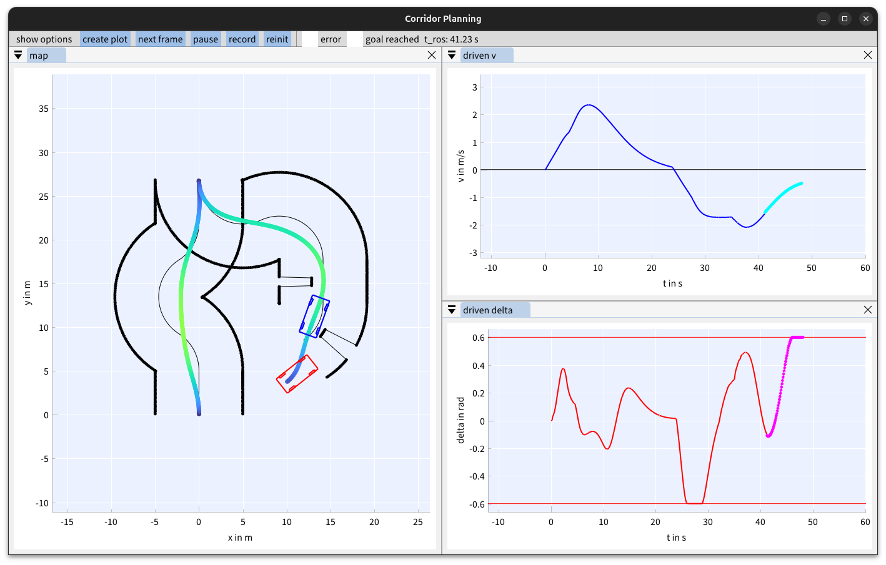

# 


## Description
This repository contains the code of the IV2025 paper called "Dynamic Objective MPC for Motion Planning of Seamless 
Docking Maneuvers"

>O. Schumann, M. Buchholz, and K. Dietmayer, “Dynamic
Objective MPC for Motion Planning of Seamless Docking
Maneuvers,” in accepted at IEEE 36th Intelligent Vehicles
Symposium (IV), 2025
> 
This algorithm is based on a model predictive contouring controller (MPCC) created in acados, which is improved by the 
methods proposed in this paper. 
These changes allow for high-precision motion planning along a reference path while being able to reach specific goal 
poses at the same time without stopping or switching to another controller.
Especially in docking scenarios, this is a common use case.


## Paper
TBA

## Citation
```
@INPROCEEDINGS{schumann2025,
  author={Schumann, Oliver and Buchholz, Michael and Dietmayer, Klaus},
  booktitle={accepted at IEEE 36th Intelligent Vehicles Symposium (IV)}, 
  title={{Dynamic Objective MPC for Motion Planning of Seamless Docking Maneuvers}},
  volume={},
  year={2025},
  number={},
}
```

## Videos
[](https://www.youtube.com/watch?v=28X5zaHW6bs)

## Setup
1. Clone the repository
2. Build the docker image
```shell
cd docker
./build.sh
```
3. Run the docker
```shell
./run_docker.sh
```
4. Build and source the module
```shell
colcon build
source colcon_build/install/setup.zsh
```
5. Run
```shell
ros2 run corridor_planning simulation.py --ros-args -p baseline:=-1 -p track_switch:=6
```

Different configurations of the planning algorithm can be run, depending on some parameters:

**baseline** \
-1: dynamic objective MPC \
0: separated motion plans \
1: switched MPCs \


**track_switch (tracks used in this paper are bold)** \
0: racing track \
1: track with switch and goal pose \
2: partially narrow track with switch and goal pose \
3: left right switches \
4: huge left turn \
5: narrow gap \
6: track with switch and goal
track with switch and goal pose
   
